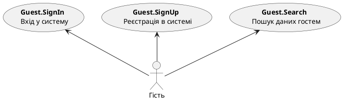

# Модель прицедентів

## Загальна схема

## Гість

 

```plantuml
@startuml

    actor "Гість" as Guest
    
    usecase "<b>Guest.Search<b> \n Пошук даних гостем" as GS
    usecase "<b>Guest.SignUp<b> \n Реєстрація в системі" as GSU
    usecase "<b>Guest.SignIn<b> \n Вхід у систему" as GSI
    
    Guest -u-> GS
    Guest -u-> GSU
    Guest -u-> GSI   

@enduml
```

